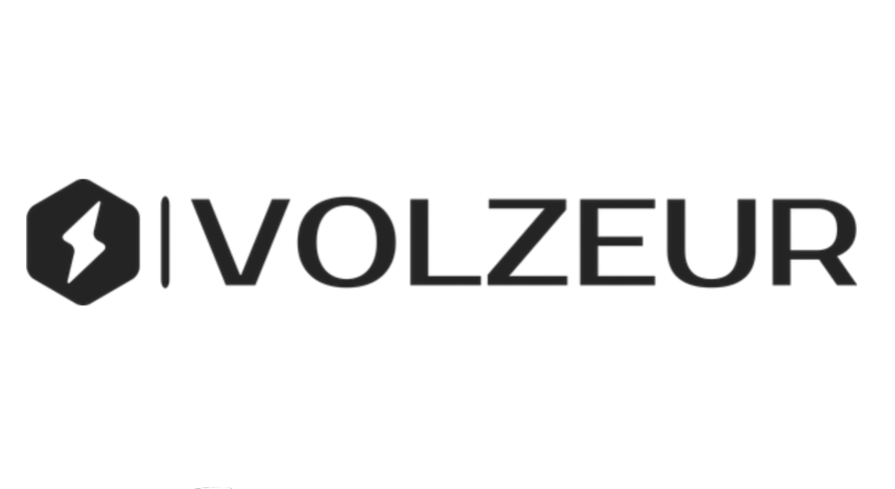

<h1 align="center"></img></h1>
<h1 align="center">Volzeur - Frontend Alternatif Gratis Bebas Iklan</h1>

## 🎯 Tentang Proyek Ini

**Volzeur** adalah sebuah proyek kecil yang menyediakan solusi alternatif untuk beberapa layanan populer seperti YouTube, YouTube Music, ChatGPT, Shortlink, CodePen, dan Google Translate dalam satu platform.

Proyek ini dibangun untuk memberikan kebebasan dan fleksibilitas kepada pengguna yang ingin mengakses layanan-layanan ini tanpa batasan, serta menyediakan kontrol penuh terhadap data dan privasi.

**Tidak ada data yang diambil, segala aktivitas dilakukan secara lokal di browser anda**

## ✨ Fitur Utama

- **Volzeur**: Layanan chatbot berbasis AI.
- **Volzeur Video**: Alternatif dari YouTube untuk menonton video tanpa iklan.
- **Volzeur Musik**: Platform streaming musik secara gratis tanpa iklan.
- **Volzeur Link**: Fitur untuk mempersingkat URL dan melacak kunjungan.
- **Volzeur Code**: Sebuah editor online yang mendukung HTML, CSS, dan JavaScript.
- **Volzeur Translate**: Layanan penerjemah berbagai bahasa internasional.

## 🚀 Cara Menggunakan

1. **Buka tautan** https://volzeur.rf.gd

2. **Pilih platform yang anda ingin gunakan**

3. **Nikmati layanan volzeur secara gratis tanpa perlu login**

Dibuat dengan ❤️ oleh Nicodemus Gurning
